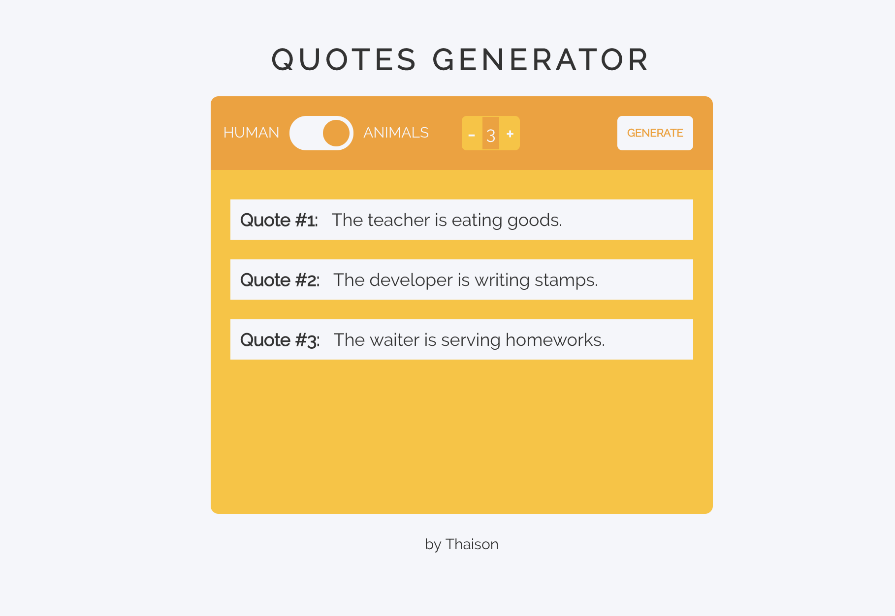

# A Simple Quote Generator
`html` `css (scss)`  `js (jquery)` `gulp`

By [Thaison Dang](https://github.com/thaisonbk57/)

# Description

This **quote generator** has 2 pre-defined topics for users to choose from. Once users have choosen the topic and the number of quotes to generate, press **GERNERATE** button to start the machine.

Each quote is generated randomly by assembling the sentence fragments together *(the sentence might not be meaningful)*
